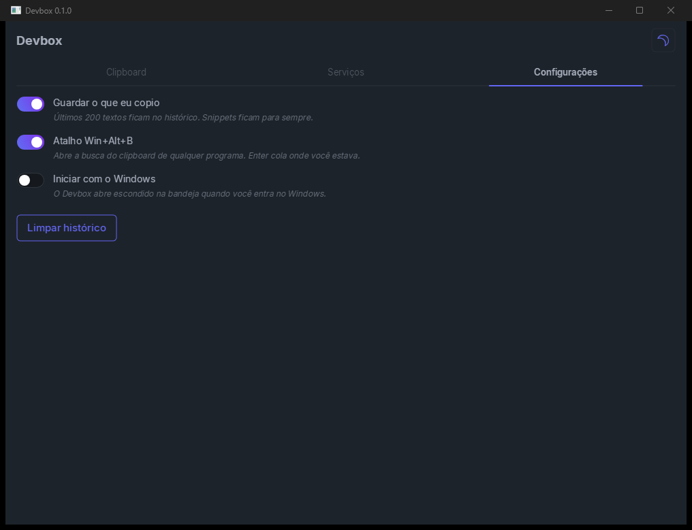

<h1 align="center">Devbox</h1>

  <b>Clipboard com histórico, snippets e seus serviços locais na bandeja do Windows.</b> 
  Win+Alt+B, digite, Enter: o texto cai na janela onde você estava.

  
  
  

  

---

## O que faz

- **Histórico do clipboard.** Os últimos 200 textos copiados, com busca. Texto repetido sobe para o topo, sem duplicar.
- **Snippets.** Fixe o que você usa sempre. Snippet não sai do histórico.
- **Cola onde você estava.** Win+Alt+B abre a busca de qualquer programa. Enter cola na janela de antes.
- **Não guarda segredo.** Senha marcada pelo gerenciador de senhas (1Password, Bitwarden, KeePass) fica de fora. Texto com cara de token, chave privada ou JWT também.
- **Containers.** Docker Desktop no Windows e Podman ou Docker dentro das distros WSL ligadas. Iniciar, parar, reiniciar e ver os logs.
- **WSL.** Quais distros estão ligadas. Abrir terminal, desligar uma ou desligar o WSL todo.
- **Portas.** Quem está escutando em cada porta TCP, qual container publica a porta. Abrir no navegador ou encerrar o processo.

## Como usar

1. Abra o `Devbox.exe`. Ele fica na bandeja.
2. Copie textos normalmente. Eles aparecem na aba **Clipboard**.
3. Em qualquer programa, aperte **Win+Alt+B**, digite parte do texto e aperte **Enter**.
4. Na aba **Serviços**, escolha a linha e use os botões de cima.

| Tecla | Faz |
|---|---|
| Win+Alt+B | Abre ou esconde a busca do clipboard |
| ↑ ↓ | Escolhem o item |
| Enter | Cola na janela de antes |
| Esc | Esconde a janela |

Fechar a janela só esconde. Para sair, use **Sair** no menu da bandeja.

  

## Onde ficam os dados

Tudo em `%LOCALAPPDATA%\Devbox\devbox.db` (SQLite), só na sua máquina. Nada vai para a rede.

## Compilar do código

> **Aviso:** o Devbox usa a suíte de componentes [ComponentesUI](https://github.com/herlondf/componentesui), que hoje é **privada**. Sem acesso a ela não dá para compilar.

Precisa do RAD Studio 12 (Studio 22.0) e da ComponentesUI em `..\Delphi\ComponentesUI`. Para outro lugar, mude a propriedade `CUI` do projeto.

Na IDE: abra `src\Devbox.dproj`. O self-check fica em `tests\DevboxTests.dproj` e termina com `TUDO OK`.

## Feito com a ComponentesUI

O Devbox é também uma vitrine da suíte. Usa `TUITabs`, `TUIInput`, `TUIFilterChip`, `TUIVirtualList`, `TUICode`, `TUIScrollArea`, `TUIStat`, `TUIDataTable` (com selos coloridos), `TUIProgressBar`, `TUIToggle`, `TUISwap` (tema claro e escuro), `TUIEmptyState` e `TUIToastManager` (com ação de confirmar no próprio aviso).

## Licença

[MIT](LICENSE).

> 🇺🇸 English version: [README_en.md](README_en.md)
