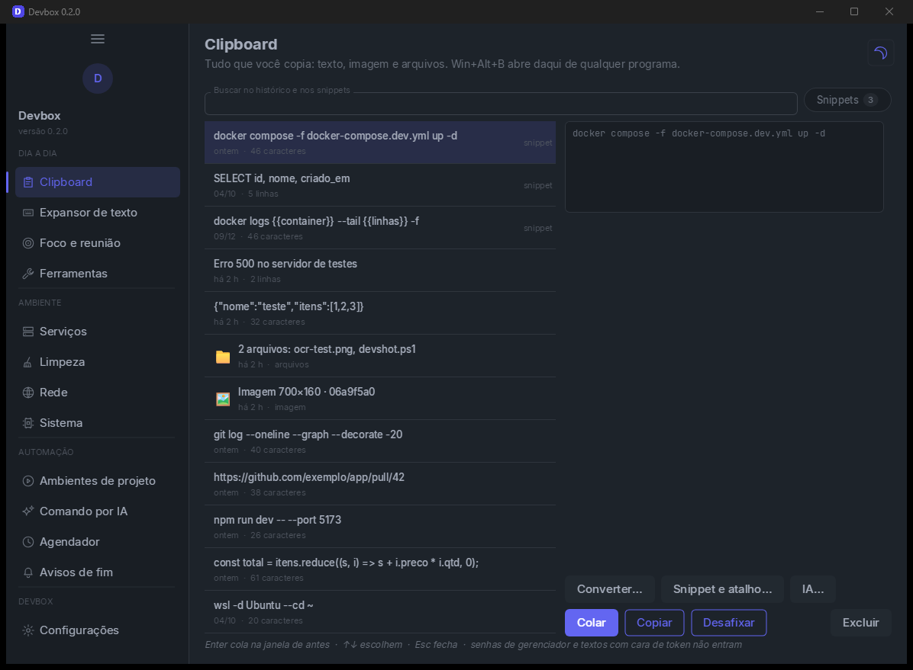
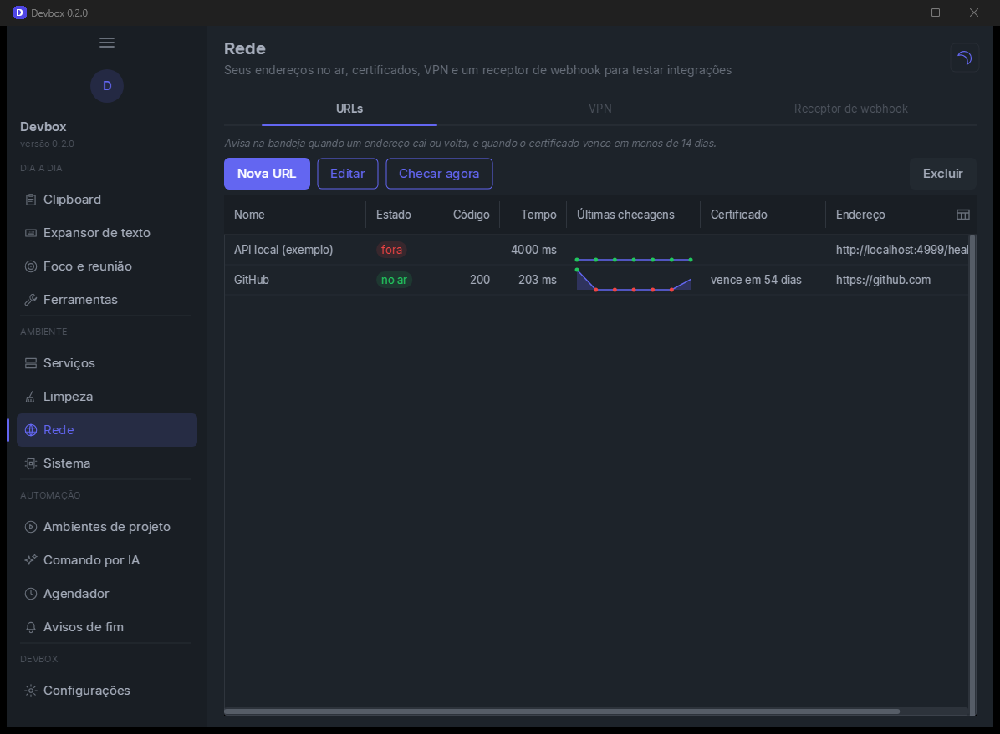
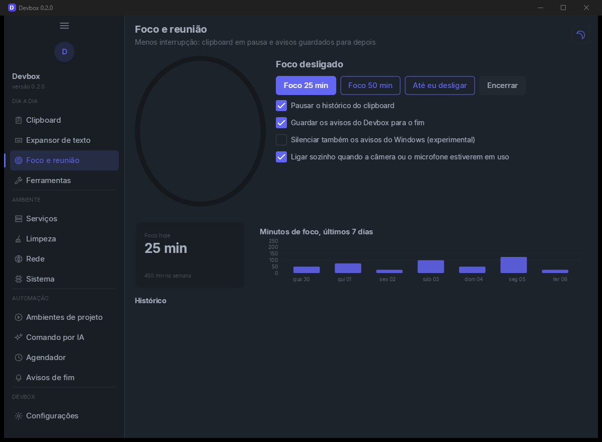

<h1 align="center">Devbox</h1>

  <b>The developer's toolbox in the Windows tray.</b> 
  Clipboard history, text expander, containers, cleanup, network, scheduler, AI and more, in one app.

  
  
  

  

> The app UI is in Brazilian Portuguese for now.

---

## What's inside

**Daily use**
- **Clipboard:** history of text, images and files, searchable, with pinned snippets. Win+Alt+B opens it from any program and Enter pastes where you were.
- **Converters:** pretty or one-line JSON, Base64, URL, JWT, timestamp, SHA-256, MD5, upper/lower case, sort and dedupe lines, GUID.
- **Copied images and files:** OCR (text from the image, using Windows itself), save PNG, SHA-256 and zip.
- **Text expander:** type `;shortcut` in any program and it becomes the snippet. `{{name}}` fields are asked before pasting. Built-ins: `;data`, `;hora`, `;agora`, `;guid`, `;ts`.
- **Focus and meetings:** clipboard paused and alerts held until the end. On for 25 or 50 minutes, until you turn it off, or automatically while the camera or mic is in use. Shows focus time per day.
- **Tools:** screenshot for bug reports (arrow, rectangle, text, step number and blur), compare `.env` files and a live log viewer with errors in red.

**Environment**
- **Services:** Docker containers on Windows and Podman/Docker inside running WSL distros, with start, stop, restart and logs. WSL distros. Listening ports with the owning process.
- **Cleanup:** build leftovers of idle projects (`node_modules`, `bin/obj`, `dcu`, `target`...), temp files and caches, large files with a chart by type, empty folders, dangling container images and startup programs.
- **Network:** URL monitor with response time and certificate expiry, VPN alert and a local webhook receiver to test integrations.
- **System:** live CPU, memory, disks and processes. User PATH editor that finds missing and duplicate folders.

**Automation**
- **Project environments:** a step script starts distro, containers, terminal, editor and browser in one click.
- **AI command:** say what you want; the AI writes the command, you check it and decide whether to run it.
- **Scheduler:** commands every N minutes, daily or on weekdays, with history and failure alerts.
- **Done alerts:** tells you when a process ends, a port closes or a container stops.

  
  

## Keys

| Key | Does |
|---|---|
| Win+Alt+B | Opens or hides the clipboard search |
| Win+Alt+S | Screenshot for a bug report |
| ↑ ↓ and Enter | Pick and paste into the previous window |
| Esc | Hides the window |

Closing the window only hides it. To quit, use **Sair** (Exit) in the tray menu.

## Privacy and safety

- Everything lives in `%LOCALAPPDATA%\Devbox\devbox.db` (SQLite), on your machine only.
- Passwords flagged by password managers and text that looks like a token or key are kept out of the history.
- The AI key lives in the Windows Credential Manager. Text only goes to the AI when you click.
- Anything that deletes or ends a process asks for confirmation. Build leftovers are deleted for good; large files and empty folders go to the Recycle Bin.
- The text expander and the screenshot run in a separate exe, `DevboxHelper.exe`, which Devbox starts and closes.

## AI

Works with Anthropic (Claude) or any OpenAI-compatible endpoint, such as Ollama or your own gateway. Set it up in **Configurações › IA** (Settings › AI).

## Build from source

> **Note:** Devbox uses the [ComponentesUI](https://github.com/herlondf/componentesui) component suite, which is currently **private**. Without access to it you cannot build.

You need RAD Studio 12 (Studio 22.0) and ComponentesUI at `..\Delphi\ComponentesUI`. For another location, change the project's `CUI` property.

In the IDE: open `src\Devbox.dproj` and `src\DevboxHelper.dproj` (both build to `bin\Win32\<config>`). The self-check is `tests\DevboxTests.dproj` and ends with `TUDO OK`.

## Built with ComponentesUI

Devbox is also a showcase for the suite: sidebar (`TUISidebar`), tables with badges and sparklines (`TUIDataTable`), charts (`TUIChart`: treemap, bars), `TUIStat`, `TUISparkline`, `TUITimeline`, `TUISteps`, `TUICountdown`, `TUIRadialProgress`, `TUIVirtualList`, `TUICode`, `TUIImage`, `TUIDropdown`, `TUITabs`, `TUIFilterChip`, `TUIToggle`, `TUICheckbox`, `TUISelect`, `TUIInput`, `TUITextArea`, `TUIBadge`, `TUIStatus`, `TUIEmptyState`, `TUISwap` and `TUIToastManager`.

## License

[MIT](LICENSE).

> 🇧🇷 Versão em português: [README.md](README.md)
